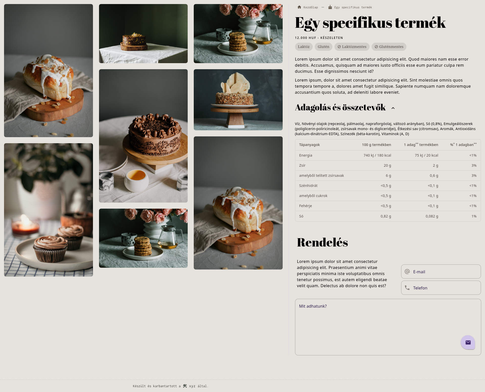
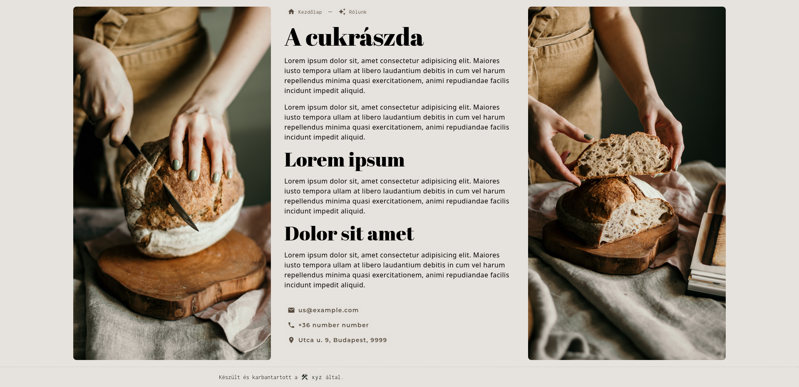

# Pastry

Currently a static site, but built with dynamic contents in mind for a pastry shop. It has great SEO and of cource it is responsive.

stack:

- spring
- thymeleaf
- google material design
  - very special webpack config to work with java directory system

clone it, run it, try it out; here's some pictures:

